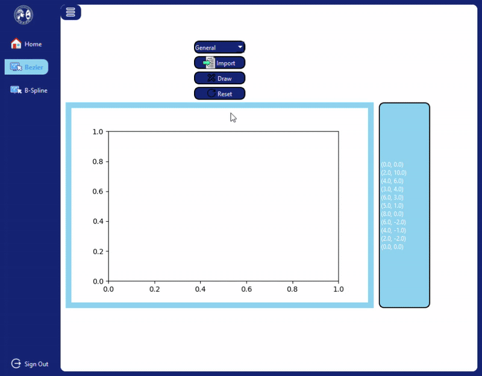
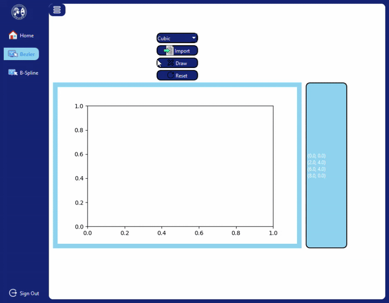
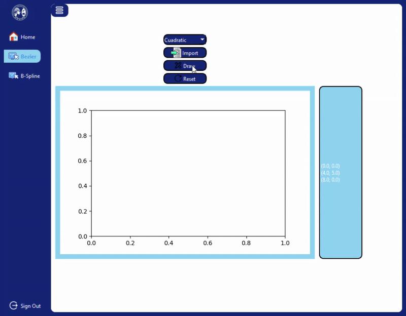
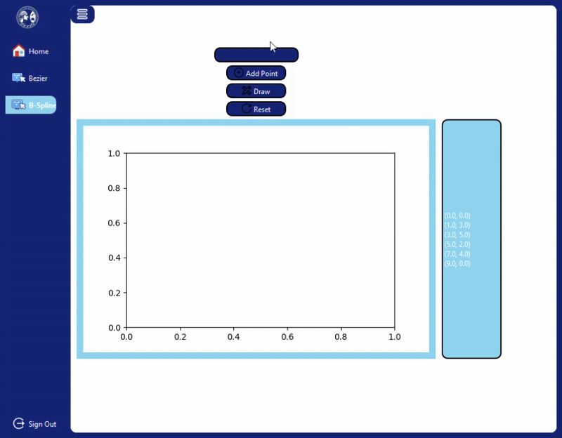

# 🎨 Bezier and B-Spline Curves

This project is a **Python-based graphical application** built using **PyQt5** and **Matplotlib** that allows users to visualize and interact with **Bezier** and **B-Spline** curves.  
Users can either import control points from a `.txt` file or add them directly through the interface, then visualize the resulting curve.

---

## 📚 Table of Contents
1. [Overview](#-overview)  
2. [Features](#-features)  
3. [Requirements](#-requirements)  
4. [Examples](#-examples)  
   - [1. General Bezier Curve](#1-general-bezier-curve)  
   - [2. Cubic Bezier Curve](#2-cubic-bezier-curve)  
   - [3. Quadratic Bezier Curve](#3-quadratic-bezier-curve)  
   - [4. B-Spline Curve](#4-b-spline-curve)  
5. [Conclusion](#-conclusion)  

---

## 🧭 Overview

The project provides an intuitive way to understand how **Bezier** and **B-Spline** curves behave by allowing interactive manipulation of control points.  
It is implemented in **Python** using **PyQt5** for the GUI and **Matplotlib** for curve rendering.

You can load control points from a text file for Bezier curves, or manually add points for B-Spline curves.

---

## ⚙️ Features

- Visualization of **Bezier** (general, cubic, and quadratic) and **B-Spline** curves  
- Import control points from `.txt` files  
- Interactive GUI built with **PyQt5**  
- Real-time curve drawing using **Matplotlib**  
- Separate pages for each algorithm  

---

## 🧩 Requirements

Install the dependencies using:

```bash
pip install -r requirements.txt
```
The requirements.txt file contains all necessary Python packages for running the application.

---

## 🖼️ Examples

### 1. General Bezier Curve

This example demonstrates a general Bezier curve with multiple control points. The curve starts at the first point and ends at the last, forming a smooth path that approximates the shape suggested by all intermediate points. It's ideal for understanding how Bezier curves handle complex shapes with more than four points.

**Control Points:**
0, 0;
2, 10;
4, 6;
3, 4;
6, 3;
5, 1;
8, 0;
6, -2;
4, -1;
2, -2;
0, 0;



### 2. Cubic Bezier Curve

The cubic Bezier curve example uses four control points. This is the most common type of Bezier curve used in graphics and design. The curve starts at the first point and ends at the last, while the two middle points influence its curvature, creating smooth transitions that are easy to predict.

**Control Points:**
0, 0;
2, 4;
6, 4;
8, 0;




### 3. Quadratic Bezier Curve

Here, a quadratic Bezier curve is illustrated using three control points. The curve is simpler than the cubic version, offering a single bending influenced by the middle control point. It's often used for simple animations, vector graphics, or paths requiring only one curve segment.

**Control Points:**
0, 0;
4, 5;
8, 0;




### 4. B-Spline Curve

The B-Spline curve passes smoothly through all the control points. Unlike Bezier curves, which only guarantee start and end points alignment, B-Splines provide more flexible shapes and are widely used in CAD, animation, and modeling for generating smooth curves that interpolate multiple points.

**Control Points:**
0, 0;
1, 3;
3, 5;
5, 2;
7, 4;
9, 0;




## 📝 Conclusion

This project offers an interactive approach to learning and experimenting with Bezier and B-Spline curves.
It demonstrates how curves can be constructed and manipulated using control points, providing a clear understanding of the differences between curve types and their behaviors.
The GUI and real-time plotting make it accessible for both educational purposes and small-scale graphical projects.


